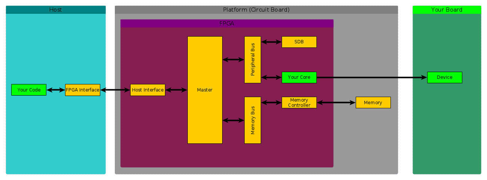

What is Nysa?
=============

Nysa is a tool that simplifies development for FPGAs.

Development for FPGAs
---------------------

FPGA development is challenging because even the simple project of blinking an LED requires user to understand

* How to write Hardware Description Language (HDL) including verilog or VHDL.
* How to constrain that design to an FPGA
* How to download that generated code to a specific FPGA platfrom.

Nysa reduces the complexity and allows users to focus on the application instead of the infrastructure. A comparison can be made between assembly language and C. Both can get the job done but when working in assembly you need to focused more on the infrastructure and not on the end product while C, although still requires effort, will help you focus on what you want to do.

Nysa is not the solution for all FPGA projects, it is designed to work for projects that contain a host controlling and an FPGA. That host can be a desktop computer, an Android phone, a single board computer or even a microcontroller like Arduino.

Below is an illustration of an entire FPGA project

The green blocks are the ones you are interested in working with. The yellow blocks represent the FPGA and software infrastructure you need to worry about in order to accomplish your project.

Nysa takes care of all the yellow parts of the project. Including the API on the host device used to control your core. When your custom core is in the FPGA you use a simple python API to control your device.

This is an example script that will blink an LED using Nysa's API:

.. code-block:: python

    import sys
    import time
    from nysa.host.driver.gpio import GPIO
    from nysa.host.platform_scanner import get_platforms

    n = get_platforms()[0]
    print "Found: %s" % str(n)

    dev_index = n.find_device(GPIO)[0]
    if dev_index is None:
        print "Failed to find GPIO Device!\n"
        sys.exit(1)

    #Get an instance of a GPIO controller
    gpio = GPIO(n, dev_index)

    print "Flashing an LED every 1 second"

    print "Set both LEDs to outputs"
    gpio.set_port_direction(0x00000003)

    while True:
        #toggle the LED at bit 0
        print "LED On!"
        gpio.set_bit_value(0, 1)
        time.sleep(0.5)
        print "LED Off!"
        gpio.set_bit_value(0, 0)
        time.sleep(0.5)

To accomplish this Nysa is broken down into three parts to address the following three aspects of FPGA development

#. **Core Developemnt:** Cores are like a class in C++, they encapsulates all the functionality required to perform a certain set of behaviors such as acquiring images from a camera sensor, controlling GPIOs. This can be a large undertaking to set up a verilog project. CBuilder is Nysa's tool that will generate a ready to go verilog project that can immediately be incorporated into a final FPGA image.
#. **FPGA Image Development:** Creating an FPGA image is usually a large and error prone task. There are a lot of things to get right. IBuilder is a tool that will read in a simple configuration file and output a vendor specific build project that will create an FPGA image by typing 'scons' on the terminal.
#. **FPGA Interaction:** After you have built an FPGA image you want to interact with it. Nysa provides infrastructure that enables users to communicate with their cores they built with CBuilder in a similar way they used to develop for it.

GUI
---

Interfacing with FPGAs is accomplished not only through a command line tools and scripts but also with a graphical user interface.

Boards
------

Any board that can talk to a 'host' can use Nysa. If you would like to port Nysa to an FPGA platform you can follow the guide in the advanced topics:

:ref:`Board Support Package <board-support-package>`

Getting Started
---------------

If you would like to get Nysa, it's free (libre), you can start with installation

:ref:`Getting Started With Nysa <getting-started>`

