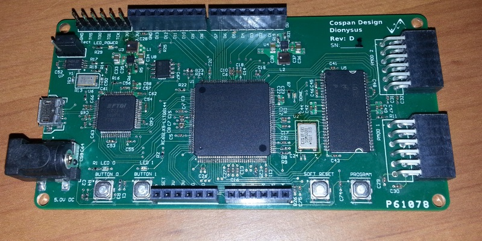
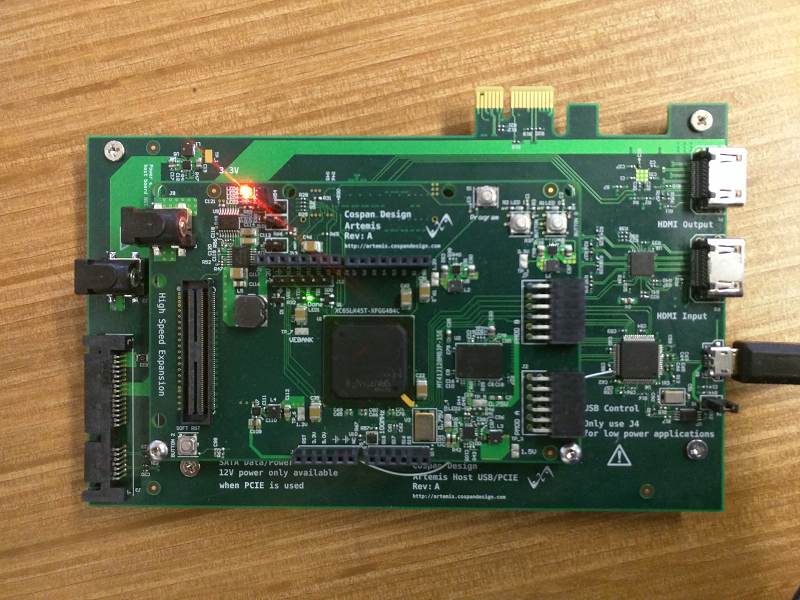
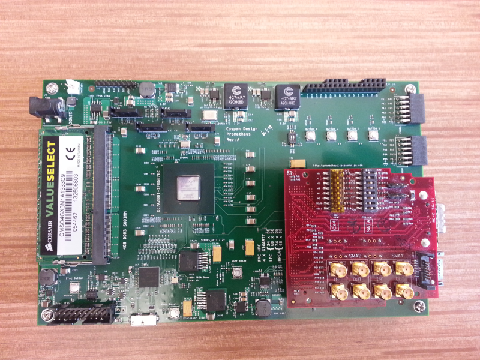

Nysa Boards
===========

Practically any FPGA board can support Nysa. The only requirement is a means to communicate with a host. This host can be a desktop computer, an embedded platform or even a microcontroller such as Arduino.

The following boards were designed with Nysa in mind.

Dionysus
--------

A Spartan 6 LX9 attached to a host computer through a USB 2.0 FIFO capable of data throughput of up to 25MBs

**Features:**

* Spartan 6 LX8
* 8MB SDRAM
* Arduino shield compatible (3.3V Shields only)
* 2 X PMOD Connectors
* 50MHz onboard oscillator

Nyx
---

A Spartan 6 LX25 attached to an Intel Edison.

.. image:: _static/nyx_board.png
    :target: _static/nyx_board.png

**Features:**

* Spartan 6 LX25
* 64MB SDRAM
* Arduino shield compatible (3.3V Shields only)
* 8 X PMOD Connectors
    * 4 X PMOD with board selectable voltages (1.2V, 1.8V, 2.5V and 3.3V)
* 8 X Differential signals brought out through industry standard SATA connectors
* 100MHz onboard oscillator

Artemis
-------

A Flexible Spartan 6 LX45T with a flexible interface to a host and expansion port that brings out SERDES. One of the most inexpensive ways to use PCI Express or SATA on your next project.

**Features:**

* Spartan 6 LX45T
* 128MB DDR3
* Arduino shield compatible (3.3V Shields only)
* 2 X PMOD Connectors
* High speed low cost expansion connector. The connector can be soldered by hand or through a reflow oven enabling users to develop boards that can interface with DSI/CSI PCI Express and SATA to name a few.
    * 46 X Differential signals
    * 2 X Gigabit transceivers
    * 2 X Gigabit transceiver clock interfaces
    * Board level selectable voltage (1.2V, 1.8V, 2.5V, 3.3V)
* High speed low cost host connector. The connector can also be soldered by hand or through a reflow oven enabling users to develop high speed interface with desktop computers, single board computers or even microcontrollers.
    * 46 X Differential signals
    * 2 X Gigabit transceivers
    * 1 X Gigabit transceiver clock interfaces
    * Host board level voltage selectable. The host board dictates the voltage on the bank allowing users to interface with the FPGA through 1.2V, 1.8V, 2.5V or 3.3V signals
* 100MHz onboard oscillator
* 100MHz low jitter on board oscillator for gigabit transceiver applications

Prometheus
----------
A higher end FPGA development board with support for standard DDR3 SODIMMs, 4 X SATA hard drives, industry standart HPC FMC and communication with the host computer using USB3.0 enabling data rates of up to 400MBs

**Features:**

* Artix 7
* 400MBs interface with host computer using a standard USB 3.0
* Support for up to 4GB of DDR3 Memory
* Support for up to 4 X SATA hard drives or generic gigabit transciever through SATA cables
* Arduino shield compatible (3.3V Shields only)
* 2 X PMOD Connectors
* Industry standard FMC HPC
    * 4X Gigabit Transcievers
    * 2X Gigabit transceiver clock interfaces
    * Board level selectable voltage (1.2V, 1.8V, 2.5V, 3.3V)

* 100MHz onboard oscillator

