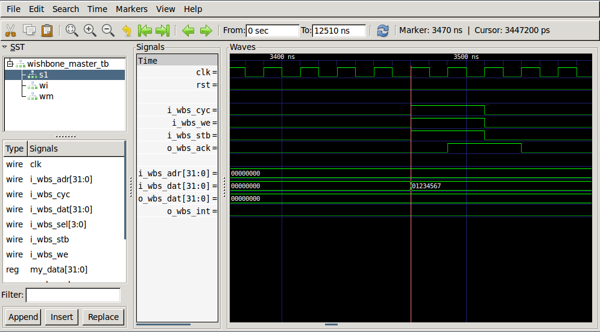

Getting Started Creating Verilog Cores
======================================

This guide will show you how to get started creating verilog projects that are easy to build, simulate and debug. Once your are done with a verilog core Ibuilder can incorporate the core into an FPGA image.

Prerequisits
------------

The main :ref:`Getting Started <getting-started>` must be completed before following this guide.

Requirements
------------

Scons
^^^^^
`Scons or Software Construction Tool <http://scons.org>`_ is a build tool similar to Make but instead of using the Make syntax it uses Python based syntax

**Installation on Ubuntu**

Within a terminal enter:

.. code-block:: bash

    sudo apt-get install scons

**Installation on Windows**

Download and install `scons <http://www.scons.org/download.php>`_

Icarus Verilog and GTKWave
^^^^^^^^^^^^^^^^^^^^^^^^^^
`IVerilog <http://iverilog.icarus.com>`_ is used to compile and simulate your verilog projects

`GTKWave <http://gtkwave.sourceforge.net>`_ is a logic waveform visualizer

**Installation on Ubuntu**
Within a terminal enter

.. code-block:: bash

    sudo apt-get install verilog
    sudo apt-get install gtkwave

**Installation on Windows**
Download and install `Icarus Verilog <http://bleyer.org/icarus>`_

First Nysa Verilog Core Project (CBuilder Project)
--------------------------------------------------
Although the tool will allow you to create a cbuilder project in any directory, it is good to put it in a place that the ibuilder tool can find it. The best place to put it is your *nysa_base/user_cbuilder_projects* directory, which is usually located at <home>/Projects/nysa_base on Ubuntu and C:\\Users\\<name>\\Projects\\nysa_base on Windows

Navigate to that directory:

.. code-block:: bash

    cd ~/Projects/nysa_base/user_cbuilder_projects

Generate a slave project:

.. code-block:: bash

    nysa generate-slave --major 0x0F wb_test_core

In a hurry? skip to `What was generated?`_

.. rst-class:: html-toggle

generate-slave command explanation
^^^^^^^^^^^^^^^^^^^^^^^^^^^^^^^^^^

The *generate-slave* command will create a verilog project with the name you specify. Here are the features of the command

.. code-block:: bash

   $> nysa generate-slave --help
    usage: nysa generate-slave [-h] [--axi] [--major MAJOR] [--minor MINOR]
                               [-o OUTPUT]
                               name

    create a project to generate a nysa compatible core

    positional arguments:
      name                  Specify the name of the project file

    optional arguments:
      -h, --help            show this help message and exit
      --axi                 Set the bus type as AXI (Wishbone by default)
      --major MAJOR         Specify the slave identification number (hex), use
                            "nysa device" command to view a list of possible
                            device IDs
      --minor MINOR         Specify the sub ID number (hex), used to identify a
                            unique version of a device Example: a unique GPIO that
                            uses internal PWMs would have a unique Sub ID to
                            differentiate itself from other GPIO devices
      -o OUTPUT, --output OUTPUT
                            Specify a location for the generated project, defaults
                            to current directory

    Examples:

    Generate a Wishbone slave project in the current directory
        ID of 0x02 (GPIO)

            name generate-slave --major 2 <name>

    Generate a Wishbone slave project with a sub id number in a specified directory
        ID of 0x03 (UART)
        Sub ID of 0x02
        Output Directory: home/user/Projects/cbuilder_projects/project1

            name generate-slave --major 3 --minor 2 --output home/user/Projects/cbuilder_projects/project1 <name>

    Generate an Axi slave project (NOT IMPLEMENTED YET!)
        ID of 0x05 (SPI)

            name generate-slave --axi --major 5 <name>

The two things that should be specified when this command is used are the major and minor numbers. This is important because when you will eventually insert this core into an FPGA the host computer uses those two numbers to identify what the core is.

A list of available major numbers can be found using the ``nysa devices`` command:

.. code-block:: bash

    $> nysa devices
    Getting device list
    Available Devices:
    SDB                  0x01 : Self Describing Bus
    GPIO                 0x02 : General Purpose Input Output
    UART                 0x03 : Universal Asynchronous Receiver and Transmitter
    I2C                  0x04 : Inter-IC Communication
    SPI                  0x05 : Serial Peripheral Interface
    Memory               0x06 : Generic Memory Device
    Console              0x07 : Generic Output Console
    FSMC                 0x08 : Flexible Static Memory Controller
    LED                  0x09 : Light Emitting Diode
    Buttons              0x0A : Buttons
    Frame Buffer         0x0B : Generic Frame Buffer
    I2S                  0x0C : Generic Inter IC Sound
    Logic Analyzer       0x0D : Logic Analyzer
    Camera               0x0E : Camera
    Experiment           0x0F : Experiment
    LCD                  0x10 : LCD Display
    STEPPER              0x11 : Stepper Motor Controller
    Clock Synth          0x12 : Clock Synthesizer
    DMA                  0x13 : Direct Memory Access controller
    Storage Manager      0x14 : Manage Storage Devices like SATA
    DMA Reader           0x20 : A test core for DMA Reader
    DMA Writer           0x21 : A test core for DMA Writer
    Platform             0x22 : A Nysa Platform

For example in the wb_gpio core the major number is 0x02, and the minor number of 0x01 (Cospan Design's version of the GPIO). This major and minor number help the software developers :ref:`write drivers <writing-a-python-driver>` that will interact with your core within an actual FPGA.

If you don't know what type of core you will be using you can enter 0x0F for **Experimental**. This value can easily be changed in the future.

What was generated?
-------------------

The command generates a new directory with the name you specified, using the tree command in Ubuntu we can see the directory structure:

.. code-block:: bash

    $> tree wb_test_core
    wb_test_core
    ├── command_file.txt
    ├── README
    ├── rtl
    │   └── wb_test_core.v
    ├── SConstruct
    ├── sim
    │   ├── master_input_test_data.txt
    │   ├── master_output_test_data.txt
    │   ├── project_defines.v
    │   └── tb_wishbone_master.v
    └── site_scons
        └── utils.py

    3 directories, 9 files

File meaning:

* README: file will also describe the directory contents
* command_file.txt: This is a list of files and commands that the build tool will read in. When adding new verilog files to your project don't forget to tell the build tool about it in here.
* rtl/wb_test_core.v: This is the generated slave project
* SConstruct: used by the scons build tool to build the project, it's very unlikely that this file should be edited
* site_scons/utils.py: used by the scons build tool to build the project: it's very unlikely this file should be edited
* sim/tb_wishbone_master.v: A test bench that wraps around your core it also reads in the master_input_test_data.txt to stimulate your core. For simple cores this doesn't need to be edited. When simulating more complicated cores that interface with an external device the simulated external device will be instantiated here.
* sim/master_input_test_data.txt: Write a list of commands that will be used to stimulate your core. This will be explained below.
* sim/master_output_test_data.txt: Output of a simulation session will output here as well as on the console.
* sim/project_defines.v: defines that will be available to the core in a real FPGA as well as a 'SIM' define to tell your core that we are in a simulation instead of an actual synthesis. It is safe to include this file within your core because the actual FPGA project will have a file with the same name that defines FPGA specific features such as the 'clock rate'

The directory is a complete, ready to build, project. You can go into that directory and build the project by using the scons tool. move into the new directory and use scons.

.. code-block:: bash

    scons

You will see this:

.. code-block:: bash

    $> scons
    scons: Reading SConscript files ...
    Fixing verilog Paths...
    scons: done reading SConscript files.
    scons: Building targets ...
    iverilog -odesign.sim -ctemp.txt
    scons: done building targets.

**What was built?**

The output of this build is ready to simulate design.sim project. To simulate use the following command

.. code-block:: bash

    scons sim

You will see this:

.. code-block:: bash

    $> scons sim
    scons: Reading SConscript files ...
    Fixing verilog Paths...
    scons: done reading SConscript files.
    scons: Building targets ...
    iverilog -odesign.sim -ctemp.txt
    vvp -n design.sim
    VCD info: dumpfile design.vcd opened for output.
    ADDR: 00000000 user wrote 00000001
    ADDR: 00000001 user wrote 0000000a
    ADDR: 00000002 user wrote 0000000b
    user read 00000000
    user read 00000001
    user read 00000002
    user read 00000000
    scons: done building targets.

The tool rebuilt the project then execute the simulation command ``vvp -n design.sim``. The tb_wishbone_master.v file opened up the master_input_test_data.txt and executed the commands. This allows you to write test benches much faster than if you were to write raw verilog test benches.

master_input_test_data\.txt
^^^^^^^^^^^^^^^^^^^^^^^^^^^

Here is the master_input_test_data.txt

.. code-block:: bash

    #Command Format:
    #[Data Count]:[Flags,Command]:[Periph Device, Address]:[Data(ignored for reads)]

    #Ping
    00000000:00000000:12345678:FEDCBA98

    #Write one peice of data to the peripheral device 1, address 0, data 1
    00000000:00000001:01000000:00000001

    #Write three peices of data to the peripheral device 1, address 1, data A, B, C
    00000003:00000001:01000001:0000000A
    0000000B
    0000000C
    0000000D

    #Read one peice of data from peripheal 1 address 0
    00000000:00000002:01000000:00000000

    #Read two peices of data from peripheral 1 address 1 (Data is a filler)
    00000002:00000002:01000001:00000000

    #Sleep
    00000008

    #Read one (1 and 0 are the same for data count) from peripheral 1 address 0
    00000001:00000002:01000000:00000000

And line starting with '#' are comments and will be ignored.

The command is broken down into four blocks

[Data Count]:[Flags,Command]:[Periph Device, Address]:[Data(ignored for reads)]

* Data Count: Number of 32-bit words to read/write to the device NOTE: 0 and 1 are the same
* Commands:
    * Flags: These are modifiers to the commands, flags like auto increment the address
    * Commands:
        * 0: Ping
        * 1: Write to the core
        * 2: Read from the core
* Address: Only useful for both read and write but a value must be put in here for the ping command
    * Peripheral address: This is the location of your core on the bus, normally enter 01 here because the core is the 2nd device on the bus.
    * Address within your core: You access your cores using addresses, Address 0x000000 will address the first address within your core.
* Data: Although this is only useful for write, a value must be put in for both read and ping, when more than one 32-bit value is written use the following lines to add more data

**Note About Sleep**: Sometimes you will want your core to process data for a number of clock cycles, adding a numeric value outside of a command will tell the simulator to let the core process for the specified number of cycles.

Waveforms
^^^^^^^^^

It helps a lot to visualize the waveforms. Use GTKWave to visualize the logic waveforms with the following command:

.. code-block:: bash

    nysa wave

A new GTKWave window should open up in the background.

How to modify the core
----------------------

The slave cores generate are simple wishbone slaves. It is designed to process commands that a wishbone master will send it. The entire set of commands are read and write.

Writing to the core
^^^^^^^^^^^^^^^^^^^

When we ran the simulation above we saw these lines towards the end:

.. code-block:: bash

    ...
    ADDR: 00000000 user wrote 00000001
    ADDR: 00000001 user wrote 0000000a
    ADDR: 00000002 user wrote 0000000b
    user read 00000000
    user read 00000001
    user read 00000002
    user read 00000000
    ...

The first three lines:

.. code-block:: bash

    ...
    ADDR: 00000000 user wrote 00000001
    ADDR: 00000001 user wrote 0000000a
    ADDR: 00000002 user wrote 0000000b
    ...

are result from a write that was initiated in the sim/master_input_test_data.txt

.. code-block:: bash

    ...
    #Write one peice of data to the peripheral device 1, address 0, data 1
    00000000:00000001:01000000:00000001

    #Write three peices of data to the peripheral device 1, address 1, data A, B, C
    00000003:00000001:01000001:0000000A
    0000000B
    0000000C
    0000000D
    ...

Inside the wb_test_core/rtl/wb_test_core.v the core processed those commands here

.. code-block:: verilog

    ...
    //After the port declaration

    //Local Parameters
    localparam     ADDR_0  = 32'h00000000;
    localparam     ADDR_1  = 32'h00000001;
    localparam     ADDR_2  = 32'h00000002;

    //Down a little more in the files
    ...
    //write request
    case (i_wbs_adr)
      ADDR_0: begin
        //writing something to address 0
        //do something

        //NOTE THE FOLLOWING LINE IS AN EXAMPLE
        //  THIS IS WHAT THE USER WILL READ FROM ADDRESS 0
        $display("ADDR: %h user wrote %h", i_wbs_adr, i_wbs_dat);
      end
      ADDR_1: begin
        //writing something to address 1
        //do something

        //NOTE THE FOLLOWING LINE IS AN EXAMPLE
        //  THIS IS WHAT THE USER WILL READ FROM ADDRESS 0
        $display("ADDR: %h user wrote %h", i_wbs_adr, i_wbs_dat);
      end
      ADDR_2: begin
        //writing something to address 3
        //do something

        //NOTE THE FOLLOWING LINE IS AN EXAMPLE
        //  THIS IS WHAT THE USER WILL READ FROM ADDRESS 0
        $display("ADDR: %h user wrote %h", i_wbs_adr, i_wbs_dat);
      end
      //add as many ADDR_X you need here
      default: begin
      end
    endcase
    ...

Notice how 0x0000000C and 0x0000000D were ignored, this is because there is no case to process these commands

The first single write command wrote to address 0x00 of this 2nd slave (Slave ID 1) on the perpheral bus. inside wb_test_core.v the condition ADDR_0 was found and the simulation task ``$display("ADDR: %h user wrote %h", i_wbs_adr, i_wbs_dat);`` resulted in the values printed to the screen.

When writing a core that talks to a host computer, this is where the core would receive values from the host.

Reading from the core
^^^^^^^^^^^^^^^^^^^^^

The last four lines of the simulation file show four reads from the core

.. code-block:: bash

    ...
    user read 00000000
    user read 00000001
    user read 00000002
    user read 00000000
    ...

These commands were a result of the read requests issued within the master_input_test_data.txt file

.. code-block:: bash

    #Read one peice of data from peripheal 1 address 0
    00000000:00000002:01000000:00000000

    #Read two peices of data from peripheral 1 address 1 (Data is a filler)
    00000002:00000002:01000001:00000000

    #Sleep
    00000008

    #Read one (1 and 0 are the same for data count) from peripheral 1 address 0
    00000001:00000002:01000000:00000000

Here is where the reads occur within wb_test_core.v

.. code-block:: verilog

    //After the port declaration

    //Local Parameters
    localparam     ADDR_0  = 32'h00000000;
    localparam     ADDR_1  = 32'h00000001;
    localparam     ADDR_2  = 32'h00000002;

    //Down a little more in the files
    ...
    //read request
    case (i_wbs_adr)
      ADDR_0: begin
        //reading something from address 0
        //NOTE THE FOLLOWING LINE IS AN EXAMPLE
        //  THIS IS WHAT THE USER WILL READ FROM ADDRESS 0
        $display("user read %h", ADDR_0);
        o_wbs_dat <= ADDR_0;
      end
      ADDR_1: begin
        //reading something from address 1
        //NOTE THE FOLLOWING LINE IS AN EXAMPLE
        //  THIS IS WHAT THE USER WILL READ FROM ADDRESS 0
        $display("user read %h", ADDR_1);
        o_wbs_dat <= ADDR_1;
      end
      ADDR_2: begin
        //reading soething from address 2
        //NOTE THE FOLLOWING LINE IS AN EXAMPLE
        //  THIS IS WHAT THE USER WILL READ FROM ADDRESS 0
        $display("user read %h", ADDR_2);
        o_wbs_dat <= ADDR_2;
      end
      //add as many ADDR_X you need here
      default: begin
      end
    endcase
    ...

Modify the code
^^^^^^^^^^^^^^^

As a first edit we can make a 32-bit register that will store a value obtained when the user writes data to address 0x00 then return that same value to the user when they read address 0x00

on line 94 add the line:

.. code-block:: verilog

    reg     [31:0]  my_data;

it should look like this afterwards:

.. code-block:: verilog

    ...
    //Local Registers/Wires
    reg     [31:0]  my_data;
    //Submodules
    //Asynchronous Logic
    //Synchronous Logic

    always @ (posedge clk) begin
      if (rst) begin
    ...

Initialize the register when a reset occurs at line 

.. code-block:: verilog

    my_data   <=  32'h0;

It should look like this afterwards:

.. code-block:: verilog

    ...
    always @ (posedge clk) begin
      if (rst) begin
        o_wbs_dat <= 32'h0;
        o_wbs_ack <= 0;
        o_wbs_int <= 0;
        my_data   <=  32'h0;
      end

      else begin
    ...

Put the data that is read into address 0 into the new register 'my_data'

On line 126

.. code-block:: verilog

    ...
    my_data   <=  i_wbs_dat; 
    ...

It should look like this afterwards:

.. code-block:: verilog

    ...
    case (i_wbs_adr)
      ADDR_0: begin
        //writing something to address 0
        //do something

        //NOTE THE FOLLOWING LINE IS AN EXAMPLE
        //  THIS IS WHAT THE USER WILL READ FROM ADDRESS 0
        $display("ADDR: %h user wrote %h", i_wbs_adr, i_wbs_dat);
        my_data   <=  i_wbs_dat; 
      end
      ADDR_1: begin
    ...

Finally, return the data back to the host when the host requests data from address 0x00

On line 157 comment out ``o_wbs_dat <= ADDR_0;`` and replace it with the following:

.. code-block:: verilog

    ...
    o_wbs_dat <= my_data;
    $display("user read from my_data: %h", my_data);
    ...

The code should look like this:

.. code-block:: verilog

    ...
    //read request
    case (i_wbs_adr)
      ADDR_0: begin
        //reading something from address 0
        //NOTE THE FOLLOWING LINE IS AN EXAMPLE
        //  THIS IS WHAT THE USER WILL READ FROM ADDRESS 0
        $display("user read %h", ADDR_0);
        //o_wbs_dat <= ADDR_0;
        o_wbs_dat <= my_data;
        $display("user read from my_data: %h", my_data);
      end
      ADDR_1: begin
        //reading something from address 1
    ...
 

Now to test it out go to the console and enter the simulation command:

.. code-block:: bash

    nysa sim

and you should see this

.. code-block:: bash

    $> nysa sim

    scons: Reading SConscript files ...
    Fixing verilog Paths...
    scons: done reading SConscript files.
    scons: Building targets ...
    iverilog -odesign.sim -ctemp.txt
    vvp -n design.sim
    VCD info: dumpfile design.vcd opened for output.
    ADDR: 00000000 user wrote 00000001  <= Writing to my_data!
    ADDR: 00000001 user wrote 0000000a
    ADDR: 00000002 user wrote 0000000b
    user read 00000000
    user read from my_data: 00000001    <= Reading from my_data!
    user read 00000001
    user read 00000002
    user read 00000000
    user read from my_data: 00000001    <= Reading from my data again!!1
    scons: done building targets.

If you want to change the data that is being written to the core modify master_input_test_data.txt on line 8

.. code-block:: bash

    #Write one peice of data to the peripheral device 1, address 0, data 1
    00000000:00000001:01000000:01234567

and the simulation output should change to:

.. code-block:: bash

    scons: Reading SConscript files ...
    Fixing verilog Paths...
    scons: done reading SConscript files.
    scons: Building targets ...
    iverilog -odesign.sim -ctemp.txt
    vvp -n design.sim
    VCD info: dumpfile design.vcd opened for output.
    ADDR: 00000000 user wrote 01234567
    ADDR: 00000001 user wrote 0000000a
    ADDR: 00000002 user wrote 0000000b
    user read 00000000
    user read from my_data: 01234567
    user read 00000001
    user read 00000002
    user read 00000000
    user read from my_data: 01234567
    scons: done building targets.

To visualize this we can open up a gtkwave session:

.. code-block:: bash

    scons wave

and find the write sequence

and the read sequence

.. image:: images/gtkwave_read_my_data.png

Conclusion
----------

This verilog core is an introduction on how to get started developing cores for Nysa. This core can also be used in other wishbone based projects.

The great thing about this core is that it is also ready to be used within an FPGA project. in the getting started manual 'Getting started with Ibuilder' I'll cover how to move this core to an actual FPGA image, then proceed to interfacing with that core using 'Getting started with Nysa host'
    

