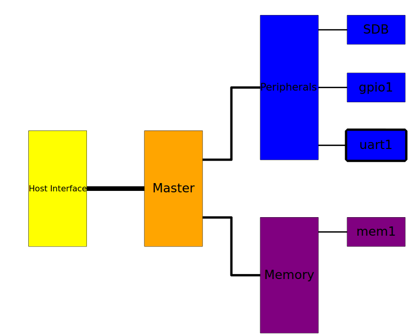
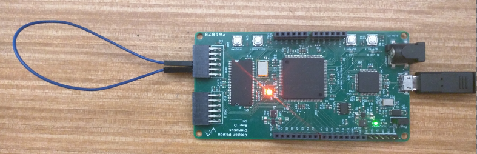
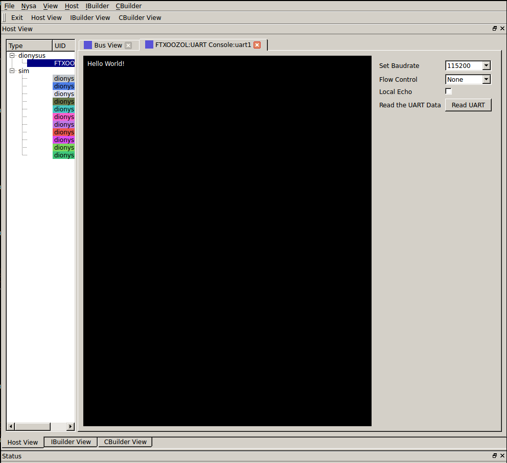

Getting started with IBuilder
=============================

This guide will show you how to get started creating FPGA images using a configuration file and nysa ibuilder tool. When you have built and downloaded an FPGA image you use the host interface to interface with your custom image.

Prerequisits
------------

The main :ref:`Getting Started <getting-started>` must be completed before following this guide.

Requirements
------------

A vendor specific build system. At the time of this writing the Xilinx build tool and Xilinx webpack must be downloaded and installed to build an actual FPGA image. The download link can be found here:

`Xilinx Webpack Download <http://www.xilinx.com/products/design-tools/ise-design-suite/ise-webpack.html>`_

First Nysa IBuilder Project (Image Builder)
-------------------------------------------

The easiest way to get started with the ibuilder is to copy a default build configuration file and modify it.

I'll be using `Dionysus <http://wiki.cospandesign.com/index.php?title=Dionysus>`_ as my target board in this demo but this demo can be adapted to work with any FPGA platform that has a supported nysa platform package. If an FPGA development board exists that is not supported by Nysa you can adapt it by following this guide: :ref:`Building a Board Support Package <board-support-package>`

.. code-block:: json

    {
        "board":"dionysus",
        "PROJECT_NAME":"example_project",
        "SLAVES":{
            "gpio1":{
                "filename":"wb_gpio.v",
                "bind":{
                    "gpio_out[1:0]":{
                        "loc":"led[1:0]",
                        "direction":"output"
                    },
                    "gpio_in[3:2]":{
                        "loc":"button[1:0]",
                        "direction":"input"
                    }
                }
            }
        }
    }

The JSON format was chosen because Python can import and export using native modules.

The configuration file can be broken down as follows:

* We are working with a dionysus board
    * ``"board":"dionysus"``
* The project name is "example_project"
    * ``"PROJECT_NAME":"example_project"``
* Add all entries to the main peripheral bus
    * "SLAVES": {..}
    * The only slave we are added is going to be called "gpio1" and it will use the wishbone module found in "wb_gpio.v"
        * "gpio1":{ "filename":"wb_gpio.v" ... }
        * The gpio1 module attaches to some pins.
            * gpio_out[1:0] are mapped to LED[1:0] and they are outputs
                * "bind" :{ "gpio_out[1:0]":{ "loc":"led[1:0]", "direction":"output"}, ...
            * gpio_in[3:2] are mapped to button[1:0] and they are inputs
                * ... "gpio_in[3:2]":{"loc":"button[1:0]", "direction":"input"}

There are many more options available including a second bus dedicated to memory but for the first project this is enough to get going. If you are interested in the more advanced options refere to :ref:`ibuilder configuration file <ibuilder-configuration>`

The file can be downloaded from here: `dionysus_base.json <https://raw.githubusercontent.com/CospanDesign/nysa-dionysus-examples/master/dionysus_base.json>`_

Now that we have a configuration file we can use the image-builder tool:

where ever you have downloaded the file you can run:

.. code-block:: bash

    nysa image-builder dionysus_base.json

This will generate the vendor specific project in a new directory called "example_project".:

.. code-block:: text

    $> nysa image-builder dionysus_base.json
    Important: ProjectGenerator:read_config_file: Injecting default board key (TEMPLATE) into project configuration
    Important: ProjectGenerator:read_config_file: Injecting default board key (INTERFACE) into project configuration
    Important: ProjectGenerator:read_config_file: Injecting default board key (MEMORY) into project configuration
    Important: ProjectGenerator:read_config_file: Injecting default board key (bind) into project configuration
    Important: ProjectGenerator:read_config_file: Injecting default board key (constraint_files) into project configuration
    Info: ProjectGenerator:generate_project: User Specified a clockrate of: 50000000
    Info: image_builder: Generating Project dionysus_base.json @ /home/cospan/Downloads/example_project

By default the tool does not output a lot of information to the command line, if you would like more information use the verbose flag for the nysa command, the above command would look like:

.. code-block:: bash

    nysa -v image-builder dionysus_base.json

**Note how the verbose flag is before the sub command**

Building the project
--------------------

After the project is generated we can build an FPGA image by changing into the directory and running scons.

.. code-block:: bash

    cd example_project
    scons

This will build the project using the vendor specific tool, in this case Xilinx tools, and the final output is a file called top.bin. The last part of the output looks like this:

.. code-block:: text

    ...

    # TOWARDS THE END

    Running DRC.
    DRC detected 0 errors and 0 warnings.
    Creating bit map...
    Saving bit stream in "build/bitgen/top.bit".
    Saving bit stream in "build/bitgen/top.bin".
    Bitstream generation is complete.

    ...

    # LAST LINES

    Generating Report ...

    Number of warnings: 0
    Number of info messages: 4
    Total time: 3 secs
    scons: done building targets.

Now the binary image is available we can uplaod the newly created image to the Dionysus board attched

Uploading the image
-------------------

As shown in the :ref:`Getting Started <getting-started>` the upload tool can be used to upload the generated top.bin image.

.. code-block:: bash

    nysa upload build/bitgen/top.bin

The output looks like this:

.. code-block:: text

    $> nysa upload build/bitgen/top.bin
    Info: upload: Found: Numonyx 2048 KB, 32 sectors each 65536 bytes
    Info: upload: Erasing the SPI flash device, this can take a minute or two...
    Info: upload: Flash erased, writing binary image to PROM
    addr: 00000000, len data: 0005327C, len self: 00200000
    Info: upload: Reading back the binary flash
    Info: upload: Verifying the data read back is correct
    Info: upload: Verification passed!

To learn about interacting with the FPGA refere to either the :ref:`Getting Started <getting-started>`, :ref:`Controlling an FPGA using a Python Script <nysa-host-python-script>` or :ref:`Extending Nysa GUI with custom scripts <nysa-gui-custom-script>`

Modifying the configuration file
--------------------------------

In order to add a new core to the final FPGA you will need to declare it within the configuration file. For a demonstration we can add a UART.

**Note:** The verilog repository that was downloaded when Nysa was initializes contains more than the wb_gpio and wb_uart modules, you can view the list of available slaves: `Nysa Slaves <https://github.com/CospanDesign/nysa-verilog/tree/master/verilog/wishbone/slave>`_

Going back to the initial design we can modify it to include the UART module:

.. code-block:: json

    {
        "board":"dionysus",
        "PROJECT_NAME":"example_project",
        "SLAVES":{
            "gpio1":{
                "filename":"wb_gpio.v",
                "bind":{
                    "gpio_out[1:0]":{
                        "loc":"led[1:0]",
                        "direction":"output"
                    },
                    "gpio_in[3:2]":{
                        "loc":"button[1:0]",
                        "direction":"input"
                    }
                }
            },
            "uart1":{
                "filename":"wb_uart.v",
                "bind":{
                    "o_tx":{
                        "loc":"PMODA2",
                        "direction":"output"
                    },
                    "i_rx":{
                        "loc":"PMODA3",
                        "direction":"input"
                    },
                    "o_cts":{
                        "loc":"PMODA1",
                        "direction":"output"
                    },
                    "i_rts":{
                        "loc":"PMODA4",
                        "direction":"input"
                    }
                }
            }
        }
    }

The source can be downloaded here:

`dionysus_uart_pmod.json <https://raw.githubusercontent.com/CospanDesign/nysa-dionysus-examples/master/dionysus_uart_pmod.json>`_

Similar to the "gpio1" module that was added the "uart1" module is just another entry into the slave list. The transmit signal and receive signal are attached to external FPGA pins as well as the the 'clear to send' and 'ready to send' signals.

This a good time to talk about FPGA constraint files.

Constraints
^^^^^^^^^^^

In order for a signal from a verilog core to be connect with a real pin we need to tell the vendor tool in a format it understands. We use a user constraint file (UCF). When using Nysa it is generally not needed to modify the constraint files unless you are performing timing critical designs or your would like to change the names of pins.

Even though you will probably not need to modify the pins it is important to know what pins are available. For this reason we should open up the constraints. We need to locate where Nysa installed the board platform projects.

The base platform directory is, by default, located:

On Ubuntu:

.. code-block:: bash

    ~/.local/nysa/boards

On Windows is

.. code-block:: bash

    C:\Users\<user name>\AppData\Roaming\Python\nysa\boards

Within this directory there should be at least one folder. For Dionysus:

.. code-block:: bash

    <base>/nysa-dionysus-platform-master

Navigate and open the file:

.. code-block:: powershell

    <base>/nysa-dionysus-platform/master/dionysus/board/dionysus.ucf

Here is an excerpt for the dionysus UCF file:

.. code-block:: text

    ...

    #PMODA
    NET PMODA1     LOC = P9   | IOSTANDARD = LVTTL ;
    NET PMODA2     LOC = P12  | IOSTANDARD = LVTTL ;
    NET PMODA3     LOC = P8   | IOSTANDARD = LVTTL ;
    NET PMODA4     LOC = P6   | IOSTANDARD = LVTTL ;
    NET PMODA7     LOC = P10  | IOSTANDARD = LVTTL ;
    NET PMODA8     LOC = P11  | IOSTANDARD = LVTTL ;
    NET PMODA9     LOC = P7   | IOSTANDARD = LVTTL ;
    NET PMODA10    LOC = P1   | IOSTANDARD = LVTTL ;

    ...

From here we can see where the names map to the actual pin numbers. The Dionysus UCF is labeled in such a way that you can usually figure out where the pin is located by the name.

The pins that were chosen for the UART were selected because they correspond to the Digilent UART pinout located on page 8 of the PMOD specification.

`PMOD Specification <http://www.digilentinc.com/Pmods/Digilent-Pmod_%20Interface_Specification.pdf>`_

Building UART Project
---------------------

Building this image is similar to building the original image,

`dionysus_uart_pmod.json <https://raw.githubusercontent.com/CospanDesign/nysa-dionysus-examples/master/dionysus_uart_pmod.json>`_

Download the image, generate the vendor project:

.. code-block:: bash

    nysa image-builder dionysus_uart_pmod.json

Change to the new directory

.. code-block:: bash

    cd example_project

Build the image

.. code-block:: bash

    scons

Upload the image

.. code-block:: bash

    nysa upload build/bitgen/top.bin

Extra
^^^^^

You can view the SDB now

.. code-block:: bash
    :emphasize-lines: 16,17,18

    $> nysa sdb-viewer
    Important: NysaSDBManager:read_sdb: Parsing Top Interconnect Buffer
    SDB
    Bus: top        @ 0x0000000000000000 : Size: 0x200000000
    Number of components: 2
         Bus: peripheral @ 0x0000000000000000 : Size: 0x03000000
         Number of components: 3
             SDB                  Type (Major:Minor) (01:00): SDB
             Address:        0x0000000000000000-0x0000000000000380 : Size: 0x00000380
             Vendor:Product: 8000000000000000:00000000

             gpio1                Type (Major:Minor) (02:01): GPIO
             Address:        0x0000000001000000-0x0000000001000008 : Size: 0x00000008
             Vendor:Product: 800000000000C594:00000002

             uart1                Type (Major:Minor) (03:01): UART
             Address:        0x0000000002000000-0x0000000002000008 : Size: 0x00000008
             Vendor:Product: 800000000000C594:00000003

         Bus: memory     @ 0x0000000100000000 : Size: 0x00800000
         Number of components: 1
             mem1                 Type (Major:Minor) (06:02): Memory
             Address:        0x0000000000000000-0x0000000000800000 : Size: 0x00800000
             Vendor:Product: 800000000000C594:00000000

Visualize the FPGA image using Nysa GUI

If you attach a loopback wire like the following

Using the nysa GUI we can use the UART plugin to demonstrate the UART

